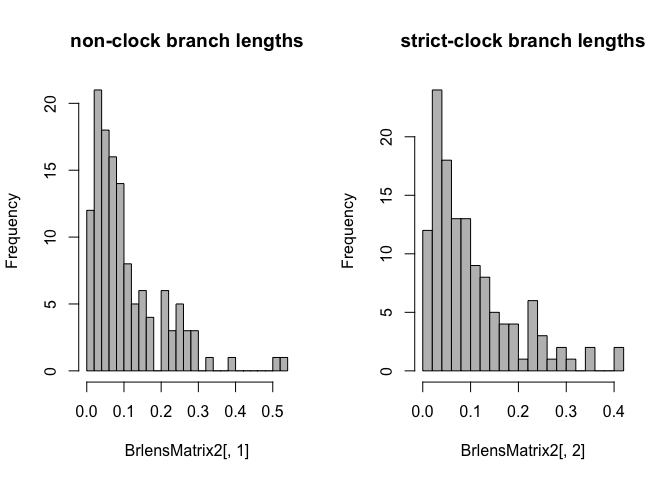
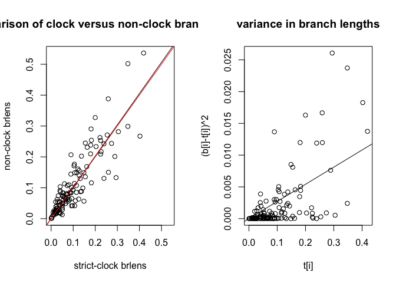

# Vea&Grimaldi-Coccomorpha divergence time IGR
Isabelle Vea  
May 3, 2015  
##Summary
This file includes the script used in Vea and Grimaldi to calculate the IGR model priors and was modified from the original script in Ronquist et al. 2012. If you use this script, please cite Ronquist et al., 2012


##Files and packages
Two nexus files are included in the folder : a strict clock and non clock tree obtained from MrBayes 3.2.3 for the Recent sampling of Coccomorpha in Vea and Grimaldi. For more details see the paper.

  -nonclock.con.tre
  
  -strictclock.con.tre
  
For this analysis you will need the following packages
  - phangorn (available in CRAN)
  
  - phyloch: can be downloaded [here] (http://www.christophheibl.de/Rpackages.html)
  
  - gplots (available in CRAN)

To see the original script from Ronquist et al., 2012


```r
download.file(url="http://datadryad.org/bitstream/handle/10255/dryad.37785/R-Scripts_PriorFitting-RelaxedClockModels.r?sequence=1", destfile="ronquist.R", method="curl")
```

Version of R

```
## [1] "R version 3.1.2 (2014-10-31)"
```

Loading packages

```r
library(phangorn)
```

```
## Loading required package: ape
## 
## Attaching package: 'phangorn'
## 
## The following object is masked from 'package:ape':
## 
##     as.prop.part
```

```r
library(phyloch) # can be downloaded at http://www.christophheibl.de/Rpackages.html
```

```
## Loading required package: colorspace
## Loading required package: XML
```

```r
library(gplots)
```

```
## 
## Attaching package: 'gplots'
## 
## The following object is masked from 'package:stats':
## 
##     lowess
```

Function and script modified from Ronquist et al., 2012

```r
#functions
compare.branches<-function(tree1,tree2,outgroup=""){
  if (length(tree1$edge)<length(tree2$edge)){
    reftree<-tree1
    testtree<-tree2
  } else {
    reftree<-tree2
    testtree<-tree1
  }
  maxNbBr<-length(reftree$edge)
  BrlenCompMatrix<-matrix(rep(NA,maxNbBr*2),nrow=maxNbBr,ncol=2)
  
  childRef<-reftree$edge[,2]
  childTest<-testtree$edge[,2]
  
  for(i in 1:length(childRef)){
    #don´t use branch if leading to outgroup
    if(!childRef[i]==which(reftree$tip.label==outgroup)){
      refVector<-list.descendents.of(reftree,childRef[i])
      if(!is.na(refVector)) {              
        refNames<-reftree$tip.label[refVector]
        refNames<-sort(refNames)
        
        for(j in 1:length(childTest)){
          testVector<-list.descendents.of(testtree,childTest[j])
          if(!is.na(testVector)){
            testNames<-testtree$tip.label[testVector]
            testNames<-sort(testNames)
            if(all(testNames==refNames)){
              BrlenCompMatrix[i,1]<-reftree$edge.length[i]
              BrlenCompMatrix[i,2]<-testtree$edge.length[j]
              j=length(testtree$edge)
            }
          }
        }
      }          
    }        
  } 
  #return matrix WITH na´s
  return(BrlenCompMatrix)     
}


list.descendents.of<-function(tree,nodeIndex){
  if(is.na(nodeIndex)) return(NA)
  if(nodeIndex<1) return(NA)
  
  parent<-tree$edge[,1]
  child<-tree$edge[,2]
  root<-as.integer(parent[!match(parent, child, 0)][1]) #match gives the positions at which the entries of the parent vector occur in the child vector. If =0, then no match and =root node
  tips<-child[is.na(!match(child,parent))]
  
  #if it is a tip
  if(length(which(tips==nodeIndex))>0){
    return(nodeIndex)
  }
  
  is.desc<-c(rep(FALSE,length(tips)))
  
  for (i in 1:length(tips)){
    index<-tips[i]
    while(index!=root){
      index<-parent[child==index]
      if(index==nodeIndex){
        is.desc[i]=TRUE
        index<-root
      }
    }
  }
  return(tips[is.desc])
}
```


```r
#Only the function definitions were kept from the `ronquist.R`, command lines were as follow:
#Importing nonclock and strictclock trees
tree1<-read.nexus("nonclock.con.tre")
tree2<-read.nexus("strictclock.con.tre")
#Comparing branch lengths from both trees, the function was defined in ronquist.R modified script
BrlensMatrix<-compare.branches(tree1,tree2,outgroup="Acyrthosiphon_pisum")
```


```r
BrlensMatrix2<-na.omit(BrlensMatrix)
#Histograms of branch length distribution
layout(matrix(1:2,1,2))
hist(BrlensMatrix2[,1],main="non-clock branch lengths",col="grey",breaks=20)
hist(BrlensMatrix2[,2],main="strict-clock branch lengths",col="grey",breaks=20)
```

 

```r
#plot of nonclock tree branch length against strict clock tree
plot(BrlensMatrix2[,2],BrlensMatrix2[,1],main="comparison of clock versus non-clock branch lengths",xlab="strict-clock brlens",ylab="non-clock brlens",xlim=c(0,max(BrlensMatrix2)),ylim=c(0,max(BrlensMatrix2)))
#calculating regression both tree branch lenghts
regression<-lm(BrlensMatrix2[,1]~BrlensMatrix2[,2]-1)
#adding regression line on plot
abline(coef=c(0,regression$coefficients))
abline(coef=c(0,1),col="red")

#calculate variance between clock and non-clock branches
obsVariance<-c(rep(NA,length(BrlensMatrix2[,2])))
for (i in 1:length(BrlensMatrix2[,2])){
  obsVariance[i]<-BrlensMatrix2[i,1]-BrlensMatrix2[i,2]
  obsVariance[i]<-obsVariance[i]^2
}
#Plotting variance
plot(BrlensMatrix2[,2],obsVariance,main="variance in branch lengths",xlab="t[i]",ylab="(b[i]-t[i])^2")
regression2<-lm(obsVariance~BrlensMatrix2[,2]-1)
abline(coef=c(0,regression2$coefficients))
```

 

```r
regression2$coefficients
```

```
## BrlensMatrix2[, 2] 
##         0.02702862
```

The median of the slope was used as the variance for the IGR model


```r
#take slope as median -> calculate mean (=rate) for exp distr of IBR model
as.numeric(regression2$coefficients)/log(2)
```

```
## [1] 0.03899406
```

```r
a<-list.descendents.of(tree1,tree1$edge[which(obsVariance==max(obsVariance))+1,2])  #+1 because root branch was not sampled by function ?compare.branches?!
tree1$tip.label[a]
```

```
## [1] "Puto_albicans"   "Puto_yuccae"     "Puto_mexicanus"  "Puto_kosztarabi"
```


##References
Ronquist, Fredrik, et al. "A total-evidence approach to dating with fossils, applied to the early radiation of the Hymenoptera." Systematic Biology 61.6 (2012): 973-999.
