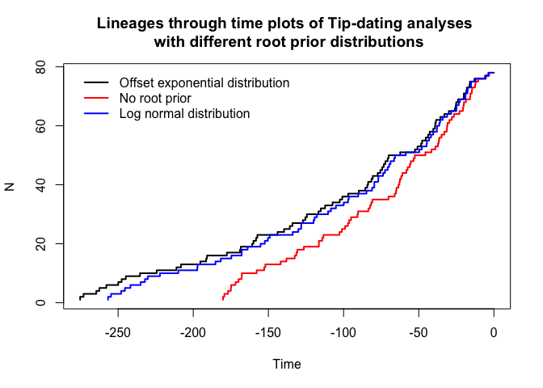
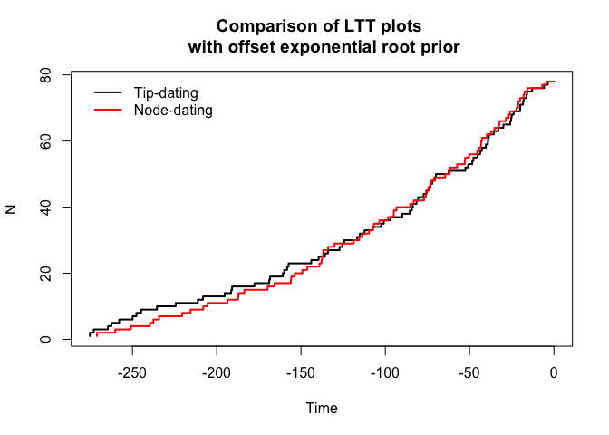
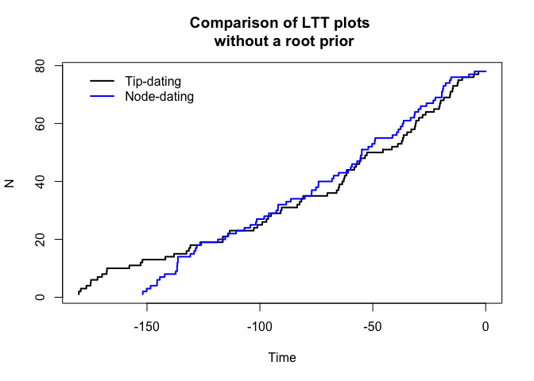
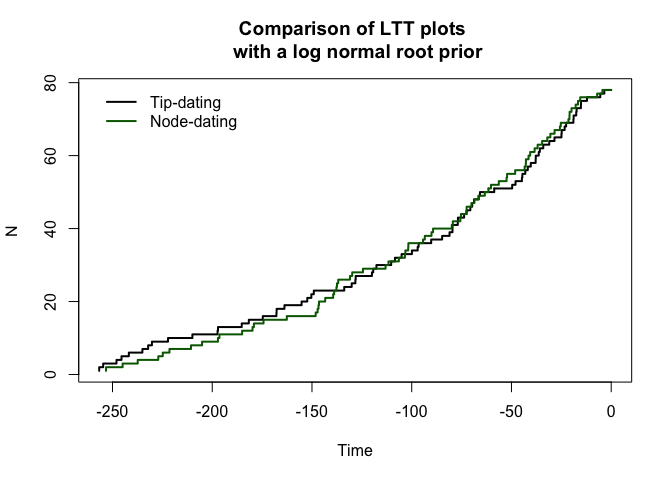
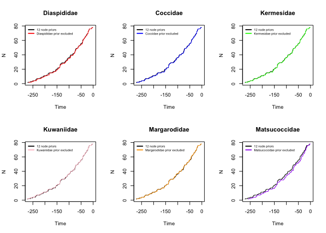
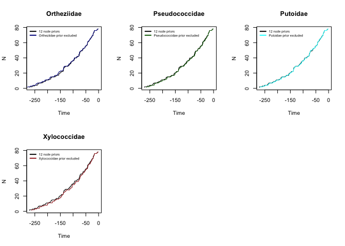

# Coccomorpha-divergence time- LTT plots
Isabelle Vea  
May 7, 2015  

##Effect of calibrations on age estimates
LTT plots were constructed using R (version) based on the phylogenies estimated for the Node-dating (total of 13 topologies) and Tip-dating (total of 3 topologies) approaches.

All trees are available at link of TreeBASE and can be directly downloaded using R : 


```
## [1] "R version 3.1.2 (2014-10-31)"
```


```r
#Loading packages
library(ape)
library(geiger)
library(phylotools)
```

```
## Loading required package: seqRFLP
## Loading required package: picante
## Loading required package: vegan
## Loading required package: permute
## Loading required package: lattice
## This is vegan 2.2-1
## Loading required package: nlme
## Loading required package: spaa
## Loading required package: fields
```

```
## Warning: package 'fields' was built under R version 3.1.3
```

```
## Loading required package: spam
## Loading required package: grid
## Spam version 1.0-1 (2014-09-09) is loaded.
## Type 'help( Spam)' or 'demo( spam)' for a short introduction 
## and overview of this package.
## Help for individual functions is also obtained by adding the
## suffix '.spam' to the function name, e.g. 'help( chol.spam)'.
## 
## Attaching package: 'spam'
## 
## The following objects are masked from 'package:base':
## 
##     backsolve, forwardsolve
## 
## Loading required package: maps
```

```r
#load trees
A<-read.nexus("ND-A-offsetexp.tre")
B<-read.nexus("ND-B.tre")
C<-read.nexus("ND-C.tre")
D<-read.nexus("ND-D.tre")
E<-read.nexus("ND-E.tre")
F<-read.nexus("ND-F.tre")
G<-read.nexus("ND-G.tre")
H<-read.nexus("ND-H.tre")
I<-read.nexus("ND-I.tre")
J<-read.nexus("ND-J.tre")
K<-read.nexus("ND-K.tre")

Anoroot<-read.nexus("ND-A-noroot.tre")
Alognormal<-read.nexus("ND-A-lognormal.tre")


TotalA<-read.nexus("TD-offsetexp.tre")
TotalB<-read.nexus("TD-noroot.tre")
TotalC<-read.nexus("TD-lognormal.tre")

#drop extinct taxa from tip-dating topologies
TotalANF<-drop.extinct(TotalA)
TotalBNF<-drop.extinct(TotalB)
TotalCNF<-drop.extinct(TotalC)

#plot ltt plots for all Tip-dating analyses with different root priors
par(mfrow=c(1,1))

ltt.plot(TotalANF, lwd=2)  #offsetexp
ltt.lines(TotalBNF, lwd=2, col="red") #noroot
ltt.lines(TotalCNF, lwd=2, col="blue") #lognormal
legend(-280,80, lwd = c(2, 2,2), lty = c(1, 1,1), col=c("black", "red", "blue"), bty = "n",legend=c("Offset exponential distribution", "No root prior", "Log normal distribution"))
title("Lineages through time plots of Tip-dating analyses \n with different root prior distributions")
```

 

```r
#ltt plots of node-dating analyses with different root priors
par(mfrow=c(1,1))

ltt.plot(A, lwd=2)  #offsetexp
ltt.lines(Anoroot, lwd=2, col="red") #noroot
ltt.lines(Alognormal, lwd=2, col="blue") #lognormal
legend(-280,80, lwd = c(2, 2,2), lty = c(1, 1,1), col=c("black", "red", "blue"), bty = "n",legend=c("Offset exponential distribution", "No root prior", "Log normal distribution"))
title("Lineages through time plots of Node-dating analyses \n with different root prior distributions")
```

 

```r
#ltt plots of node-dating against tip-dating, same root priors
#par(mfrow=c(3,1))
ltt.plot(TotalANF, lwd=2) 
ltt.lines(A, lwd=2, col="red")
legend(-280,80, lwd = c(2, 2), lty = c(1, 1), col=c("black", "red"), bty = "n",legend=c("Tip-dating", "Node-dating"))
title("Comparison of LTT plots \n with offset exponential root prior")
```

 

```r
ltt.plot(TotalBNF, lwd=2) 
ltt.lines(Anoroot, lwd=2, col="blue")
legend(-180,80, lwd = c(2, 2), lty = c(1, 1), col=c("black", "blue"), bty = "n",legend=c("Tip-dating", "Node-dating"))
title("Comparison of LTT plots \n without a root prior")
```

 

```r
ltt.plot(TotalCNF, lwd=2) 
ltt.lines(Alognormal, lwd=2, col="dark green")
legend(-260,80, lwd = c(2, 2), lty = c(1, 1), col=c("black", "dark green"), bty = "n",legend=c("Tip-dating", "Node-dating"))
title("Comparison of LTT plots \n with a log normal root prior")
```

 

```r
#Node-dating LTT plots of topologies removing one node prior at a time
par(mfrow=c(2,3))

ltt.plot(A,lwd=1)
ltt.lines(B,col="red",lwd=1)
legend(-280,80, cex=0.6,lwd = c(2, 2,2), lty = c(1, 1,1), col=c("black", "red"), bty = "n",legend=c("12 node priors", "Diaspididae prior excluded"))
title("Diaspididae")


ltt.plot(A,lwd=1)
ltt.lines(C,col="blue",lwd=1)
legend(-280,80, cex=0.6,lwd = c(2, 2,2), lty = c(1, 1,1), col=c("black", "blue"), bty = "n",legend=c("12 node priors", "Coccidae prior excluded"))
title("Coccidae")

ltt.plot(A,lwd=1)
ltt.lines(D,col="green",lwd=1)
legend(-280,80, cex=0.6,lwd = c(2, 2,2), lty = c(1, 1,1), col=c("black", "green"), bty = "n",legend=c("12 node priors", "Kermesidae prior excluded"))
title("Kermesidae")

ltt.plot(A,lwd=1)
ltt.lines(E,col="pink",lwd=1)
legend(-280,80, cex=0.6,lwd = c(2, 2,2), lty = c(1, 1,1), col=c("black", "pink"), bty = "n",legend=c("12 node priors", "Kuwaniidae prior excluded"))
title("Kuwaniidae")

ltt.plot(A,lwd=1)
ltt.lines(F,col="orange",lwd=1)
legend(-280,80, cex=0.6,lwd = c(2, 2,2), lty = c(1, 1,1), col=c("black", "orange"), bty = "n",legend=c("12 node priors", "Margarodidae prior excluded"))
title("Margarodidae")

ltt.plot(A,lwd=1)
ltt.lines(G,col="purple",lwd=1)
legend(-280,80, cex=0.6,lwd = c(2, 2,2), lty = c(1, 1,1), col=c("black", "purple"), bty = "n",legend=c("12 node priors", "Matsucoccidae prior excluded"))
title("Matsucoccidae")
```

 

```r
ltt.plot(A,lwd=1)
ltt.lines(H,col="dark blue",lwd=1)
legend(-280,80, cex=0.6,lwd = c(2, 2,2), lty = c(1, 1,1), col=c("black", "dark blue"), bty = "n",legend=c("12 node priors", "Ortheziidae prior excluded"))
title("Ortheziidae")

ltt.plot(A,lwd=1)
ltt.lines(I,col="dark green",lwd=1)
legend(-280,80, cex=0.6,lwd = c(2, 2,2), lty = c(1, 1,1), col=c("black", "dark green"), bty = "n",legend=c("12 node priors", "Pseudococcidae prior excluded"))
title("Pseudococcidae")

ltt.plot(A,lwd=1)
ltt.lines(J,col="cyan",lwd=1)
legend(-280,80, cex=0.6,lwd = c(2, 2,2), lty = c(1, 1,1), col=c("black", "cyan"), bty = "n",legend=c("12 node priors", "Putoidae prior excluded"))
title("Putoidae")

ltt.plot(A,lwd=1)
ltt.lines(K,col="brown",lwd=1)
legend(-280,80, cex=0.6,lwd = c(2, 2,2), lty = c(1, 1,1), col=c("black", "brown"), bty = "n",legend=c("12 node priors", "Xylococcidae prior excluded"))
title("Xylococcidae")
```

 


