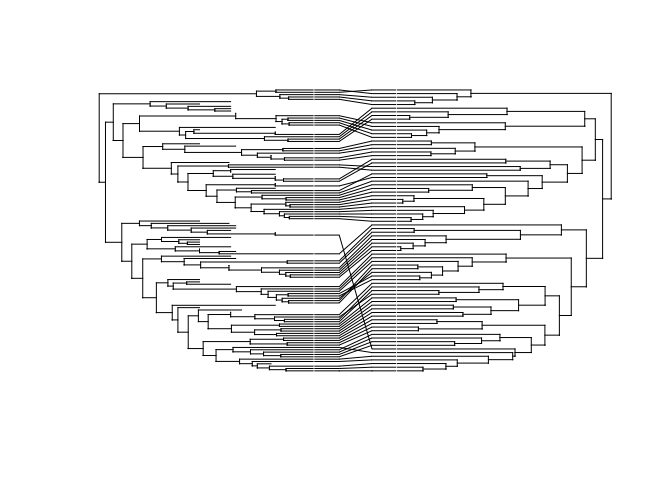
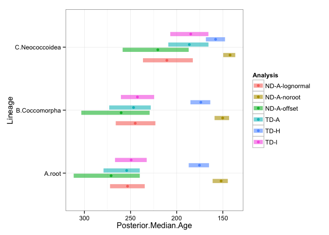
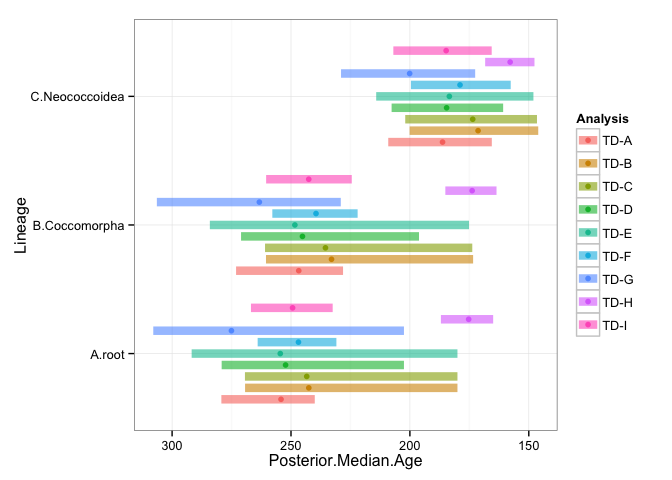
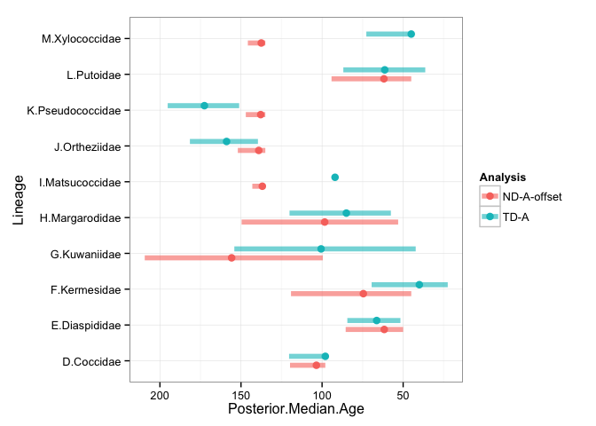
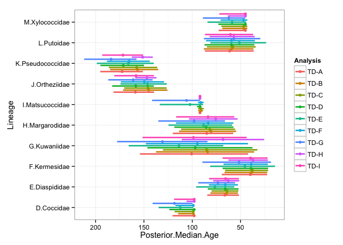
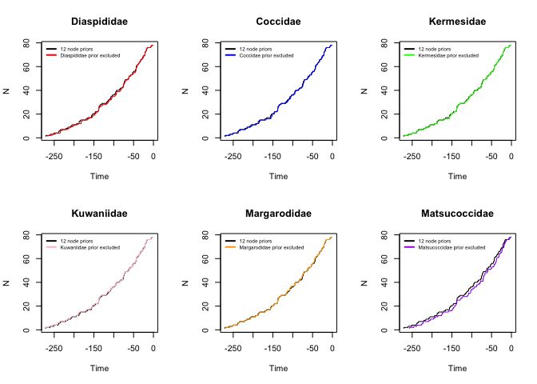
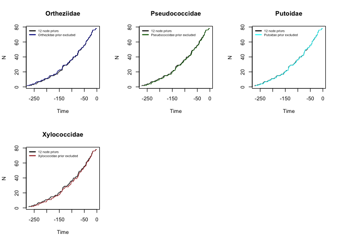

# Coccomorpha-divergence time- LTT plots
Isabelle Vea  
May 7, 2015  

##Effect of calibrations on age estimates
LTT plots were constructed using R (version) based on the phylogenies estimated for the Node-dating (total of 13 topologies) and Tip-dating (total of 3 topologies) approaches.

All trees are available at link of TreeBASE and can be directly downloaded using R : 


```
## [1] "R version 3.2.0 (2015-04-16)"
```
##Data

```r
#Loading packages
library(ape)
```

```
## Warning: package 'ape' was built under R version 3.2.3
```

```r
library(geiger)
library(phylotools)
```

```
## Loading required package: seqRFLP
## Loading required package: picante
## Loading required package: vegan
```

```
## Warning: package 'vegan' was built under R version 3.2.2
```

```
## Loading required package: permute
## Loading required package: lattice
## This is vegan 2.3-2
## Loading required package: nlme
## Loading required package: spaa
## Loading required package: fields
## Loading required package: spam
## Loading required package: grid
## Spam version 1.3-0 (2015-10-24) is loaded.
## Type 'help( Spam)' or 'demo( spam)' for a short introduction 
## and overview of this package.
## Help for individual functions is also obtained by adding the
## suffix '.spam' to the function name, e.g. 'help( chol.spam)'.
## 
## Attaching package: 'spam'
## 
## The following objects are masked from 'package:base':
## 
##     backsolve, forwardsolve
## 
## Loading required package: maps
## 
##  # ATTENTION: maps v3.0 has an updated 'world' map.        #
##  # Many country borders and names have changed since 1990. #
##  # Type '?world' or 'news(package="maps")'. See README_v3. #
```

```r
library(RColorBrewer)
library(ggplot2)


#loading node dating trees
A<-ladderize(read.nexus("ND-A-offsetexp.tre"))
B<-ladderize(read.nexus("ND-B.tre"))
C<-ladderize(read.nexus("ND-C.tre"))
D<-ladderize(read.nexus("ND-D.tre"))
E<-ladderize(read.nexus("ND-E.tre"))
F<-ladderize(read.nexus("ND-F.tre"))
G<-ladderize(read.nexus("ND-G.tre"))
H<-ladderize(read.nexus("ND-H.tre"))
I<-ladderize(read.nexus("ND-I.tre"))
J<-ladderize(read.nexus("ND-J.tre"))
K<-ladderize(read.nexus("ND-K.tre"))

Anoroot<-ladderize(read.nexus("ND-A-noroot.tre"))
Alognormal<-ladderize(read.nexus("ND-A-lognormal.tre"))

#loading tip dating trees
TotalA<-ladderize(read.nexus("TD-A.con.tre"))
TotalB<-ladderize(read.nexus("TD-B.con.tre"))
TotalC<-ladderize(read.nexus("TD-C.con.tre"))
TotalD<-ladderize(read.nexus("TD-D.con.tre"))
TotalE<-ladderize(read.nexus("TD-E.con.tre"))
TotalF<-ladderize(read.nexus("TD-F.con.tre"))
TotalG<-ladderize(read.nexus("TD-G.con.tre"))
TotalH<-ladderize(read.nexus("TD-H.con.tre"))
TotalI<-ladderize(read.nexus("TD-I.con.tre"))

#loading posterior ages csv file
age<-read.csv("ages-VeaGrimaldi.csv",header=TRUE)
```

##Co-phylogeny (Figure 4a)

```r
#using TotalA and A
association<-matrix(ncol=2, nrow=78)
association[,1]<-association[,2]<-A$tip.label

cophyloplot(TotalA,A, assoc=association,space=100, use.edge.length=TRUE, show.tip.label=FALSE,color="red")
```

 

##Age plots
###Figure 4b


```r
#effect of root prior and TD- ND
rootage<-subset(age, Analysis=="TD-A"|Analysis=="TD-H"|Analysis=="TD-I"|Analysis=="ND-A-offset"|Analysis=="ND-A-noroot"|Analysis=="ND-A-lognormal")
root2age<-subset(rootage, Lineage=="A.root"|Lineage=="B.Coccomorpha"|Lineage=="C.Neococcoidea")
ggplot(root2age, aes(x =Lineage , y =Posterior.Median.Age, ymin = X95..upper, ymax = X95..lower)) +
  geom_linerange(aes(color = Analysis), position=position_dodge(width=0.5), size = 3, alpha = 0.6) +
  geom_point(aes(color = Analysis), position=position_dodge(width=0.5), size = 2) + 
  theme_bw() + coord_flip()+scale_y_reverse()
```

 
### Figure 5: Tip dating parameters comparison

```r
cbPalette <- c("#999999", "#E69F00", "#56B4E9", "#009E73", "#F0E442", "#0072B2", "#D55E00", "#CC79A7","#000000")


cocoage<-subset(age, Lineage=="A.root"|Lineage=="B.Coccomorpha"|Lineage=="C.Neococcoidea")
coco2age<-subset(cocoage, Analysis=="TD-A"|Analysis=="TD-B"|Analysis=="TD-C"|Analysis=="TD-D"|Analysis=="TD-E"|Analysis=="TD-F"|Analysis=="TD-G"|Analysis=="TD-H"|Analysis=="TD-I")

ggplot(coco2age, aes(x =Lineage , y =Posterior.Median.Age, ymin = X95..upper, ymax = X95..lower)) +
  geom_linerange(aes(color = Analysis), position=position_dodge(width=0.8), size = 3, alpha = 0.6) +
  geom_point(aes(color = Analysis), position=position_dodge(width=0.8), size = 2) + 
  theme_bw() + coord_flip()+scale_y_reverse()
```

 
###Figure S2: A.Comparison between node-dating and tip-dating approaches of the posterior ages (median) and 95% HDP for lineages with age priors used in the node-dating analysis. B. LTT Plots of ND and TD approaches. 


```r
#a
TDNDage<-subset(age, Analysis=="TD-A"|Analysis=="ND-A-offset")
TDNDage2<-subset(TDNDage, Lineage=="D.Coccidae"|Lineage=="E.Diaspididae"|Lineage=="F.Kermesidae"|Lineage=="G.Kuwaniidae"|Lineage=="H.Margarodidae"|Lineage=="I.Matsucoccidae"|Lineage=="J.Ortheziidae"|Lineage=="K.Pseudococcidae"|Lineage=="L.Putoidae"|Lineage=="M.Xylococcidae")

ggplot(TDNDage2, aes(x =Lineage , y = Posterior.Median.Age, ymin = X95..upper
, ymax = X95..lower)) +
geom_linerange(aes(color = Analysis), position=position_dodge(width=c(0.5)), size = 2, alpha = 0.6) +
geom_point(aes(color = Analysis), position=position_dodge(width=c(0.5)), size = 3) +
theme_bw()+coord_flip()+scale_y_reverse()
```

 

###Figure S3: Comparison among tip-dating analyses of the posterior ages (median and 95 % HDP) for lineages with age priors used in the node-dating analysis. For the parameters used in each tip-dating analysism, refer to Table 1.


```r
TDage<-subset(age, Analysis=="TD-A"|Analysis=="TD-B"|Analysis=="TD-C"|Analysis=="TD-D"|Analysis=="TD-E"|Analysis=="TD-F"|Analysis=="TD-G"|Analysis=="TD-H"|Analysis=="TD-I")
TDage2<-subset(TDage, Lineage=="D.Coccidae"|Lineage=="E.Diaspididae"|Lineage=="F.Kermesidae"|Lineage=="G.Kuwaniidae"|Lineage=="H.Margarodidae"|Lineage=="I.Matsucoccidae"|Lineage=="J.Ortheziidae"|Lineage=="K.Pseudococcidae"|Lineage=="L.Putoidae"|Lineage=="M.Xylococcidae")

ggplot(TDage2, aes(x =Lineage , y = Posterior.Median.Age, ymin = X95..upper
, ymax = X95..lower)) +
geom_linerange(aes(color = Analysis), position=position_dodge(width=c(0.9)), size = 1, alpha = 1) +
geom_point(aes(color = Analysis), position=position_dodge(width=c(0.9)), size = 2) +
theme_bw()+coord_flip()+scale_y_reverse()
```

 
#LTT Plots


```r
#Node-dating LTT plots of topologies removing one node prior at a time
par(mfrow=c(2,3))

ltt.plot(A,lwd=1)
ltt.lines(B,col="red",lwd=1)
legend(-280,80, cex=0.6,lwd = c(2, 2,2), lty = c(1, 1,1), col=c("black", "red"), bty = "n",legend=c("12 node priors", "Diaspididae prior excluded"))
title("Diaspididae")


ltt.plot(A,lwd=1)
ltt.lines(C,col="blue",lwd=1)
legend(-280,80, cex=0.6,lwd = c(2, 2,2), lty = c(1, 1,1), col=c("black", "blue"), bty = "n",legend=c("12 node priors", "Coccidae prior excluded"))
title("Coccidae")

ltt.plot(A,lwd=1)
ltt.lines(D,col="green",lwd=1)
legend(-280,80, cex=0.6,lwd = c(2, 2,2), lty = c(1, 1,1), col=c("black", "green"), bty = "n",legend=c("12 node priors", "Kermesidae prior excluded"))
title("Kermesidae")

ltt.plot(A,lwd=1)
ltt.lines(E,col="pink",lwd=1)
legend(-280,80, cex=0.6,lwd = c(2, 2,2), lty = c(1, 1,1), col=c("black", "pink"), bty = "n",legend=c("12 node priors", "Kuwaniidae prior excluded"))
title("Kuwaniidae")

ltt.plot(A,lwd=1)
ltt.lines(F,col="orange",lwd=1)
legend(-280,80, cex=0.6,lwd = c(2, 2,2), lty = c(1, 1,1), col=c("black", "orange"), bty = "n",legend=c("12 node priors", "Margarodidae prior excluded"))
title("Margarodidae")

ltt.plot(A,lwd=1)
ltt.lines(G,col="purple",lwd=1)
legend(-280,80, cex=0.6,lwd = c(2, 2,2), lty = c(1, 1,1), col=c("black", "purple"), bty = "n",legend=c("12 node priors", "Matsucoccidae prior excluded"))
title("Matsucoccidae")
```

 

```r
ltt.plot(A,lwd=1)
ltt.lines(H,col="dark blue",lwd=1)
legend(-280,80, cex=0.6,lwd = c(2, 2,2), lty = c(1, 1,1), col=c("black", "dark blue"), bty = "n",legend=c("12 node priors", "Ortheziidae prior excluded"))
title("Ortheziidae")

ltt.plot(A,lwd=1)
ltt.lines(I,col="dark green",lwd=1)
legend(-280,80, cex=0.6,lwd = c(2, 2,2), lty = c(1, 1,1), col=c("black", "dark green"), bty = "n",legend=c("12 node priors", "Pseudococcidae prior excluded"))
title("Pseudococcidae")

ltt.plot(A,lwd=1)
ltt.lines(J,col="cyan",lwd=1)
legend(-280,80, cex=0.6,lwd = c(2, 2,2), lty = c(1, 1,1), col=c("black", "cyan"), bty = "n",legend=c("12 node priors", "Putoidae prior excluded"))
title("Putoidae")

ltt.plot(A,lwd=1)
ltt.lines(K,col="brown",lwd=1)
legend(-280,80, cex=0.6,lwd = c(2, 2,2), lty = c(1, 1,1), col=c("black", "brown"), bty = "n",legend=c("12 node priors", "Xylococcidae prior excluded"))
title("Xylococcidae")
```

 


